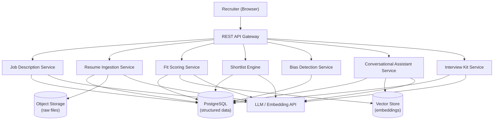

# Design Document: AI Hiring Platform

## Overview

The AI Hiring Platform is an AI-augmented Applicant Tracking System (ATS) that reduces manual recruiter effort by automating resume parsing, candidate scoring, shortlist generation, interview kit creation, and conversational pipeline querying. The platform embeds multiple specialized AI agents that operate on structured data extracted from job descriptions and resumes, producing explainable, bias-aware recommendations.

The system is designed as a service-oriented backend with a web frontend. AI components are modular and independently replaceable. All candidate data is stored in a structured form to support consistent scoring, serialization, and retrieval.

### Tech Stack

| Layer | Technology | Rationale |
|---|---|---|
| Backend | NestJS (TypeScript) | Modular architecture maps cleanly to domain services; decorators, DI, and Guards simplify auth and validation |
| Frontend | React (TypeScript) + Vite | Component-driven UI for recruiter dashboard and chat interface; fast dev experience |
| UI Styling | TailwindCSS | Utility-first, pairs well with React component libraries |
| Database | PostgreSQL + pgvector | Structured data and embedding-based vector search in a single DB instance |
| ORM | TypeORM or Prisma | Type-safe DB access from NestJS |
| File Storage | AWS S3 (or MinIO for local dev) | Raw resume and JD file storage |
| AI / Embeddings | OpenAI API (`text-embedding-ada-002`, GPT-4o) | Embeddings for fit scoring; GPT-4o for parsing, summarization, interview kit generation |
| LLM Orchestration | LangChain.js | Conversational assistant multi-turn context and AI pipeline orchestration |
| Document Parsing | pdf-parse + mammoth | PDF and DOCX extraction in Node.js |
| PDF Export | Puppeteer or pdfmake | Server-side PDF generation for Interview Kit export |
| Session Cache | Redis | Conversational assistant session state |
| Testing (PBT) | fast-check (Jest) | Property-based testing for TypeScript backend and frontend |
| Infrastructure | Docker + Docker Compose | Local dev environment |

### Key Design Decisions

- Embedding-based semantic similarity (e.g., OpenAI `text-embedding-ada-002` or equivalent) drives fit scoring, enabling nuanced matching beyond keyword overlap.
- All AI agent outputs are deterministic given the same inputs (with caching) to satisfy the ±2 point score consistency requirement.
- Candidate_Profile uses a versioned JSON schema to support round-trip serialization integrity.
- The Conversational_Assistant uses a session-scoped context window to maintain multi-turn query state.
- Bias detection operates as a post-processing step on score breakdowns, never as an input to scoring.
- NestJS modules map 1:1 to domain services (JobsModule, ResumesModule, ScoringModule, etc.), keeping boundaries clean.
- pgvector is used instead of a separate vector DB to reduce infrastructure complexity for the prototype.

---

## Architecture



The platform follows a layered architecture:

- API Gateway: Handles authentication, authorization, and request routing.
- Domain Services: Each AI capability is encapsulated in its own service with a clear interface.
- Persistence Layer: PostgreSQL for structured records; a vector store (e.g., Pinecone or pgvector) for embedding-based retrieval; object storage (e.g., S3) for raw uploaded files.
- AI Layer: A shared LLM/embedding client abstraction used by all services, enabling model swapping without service changes.

---

## Components and Interfaces

### Job Description Service

Responsibilities: parse uploaded JD files, generate Screening_Criteria via LLM, persist structured records.

```
POST /jobs                          - upload and parse a Job_Description
GET  /jobs/{job_id}                 - retrieve a Job_Description record
PUT  /jobs/{job_id}/criteria        - save updated Screening_Criteria
GET  /jobs/{job_id}/criteria        - retrieve Screening_Criteria
```

### Resume Ingestion Service

Responsibilities: parse uploaded resumes, extract Candidate_Profiles, normalize skills, generate summaries, support batch ingestion.

```
POST /jobs/{job_id}/resumes         - upload one or more resumes (batch)
GET  /jobs/{job_id}/candidates      - list Candidate_Profiles for a job
GET  /candidates/{candidate_id}     - retrieve a single Candidate_Profile
```

### Fit Scoring Service

Responsibilities: compute Fit_Scores using embedding similarity, produce score breakdowns, recompute on criteria change.

```
POST /jobs/{job_id}/candidates/{candidate_id}/score  - trigger scoring
GET  /jobs/{job_id}/candidates/{candidate_id}/score  - retrieve score + breakdown
POST /jobs/{job_id}/rescore                          - recompute all scores after criteria update
```

### Shortlist Engine

Responsibilities: rank candidates by Fit_Score, apply recruiter filters, generate natural language reasoning, persist recruiter decisions.

```
POST /jobs/{job_id}/shortlist       - generate shortlist (body: size, filters)
GET  /jobs/{job_id}/shortlist       - retrieve current shortlist
PATCH /jobs/{job_id}/shortlist/{candidate_id}  - accept/reject/defer a candidate
```

### Bias Detection Service

Responsibilities: analyze score breakdowns for demographic proxy signals, attach warnings to profiles, generate bias reports.

```
GET  /jobs/{job_id}/candidates/{candidate_id}/bias   - get bias flags for a candidate
GET  /jobs/{job_id}/bias-report                      - generate aggregate bias report
```

### Conversational Assistant Service

Responsibilities: interpret natural language queries, maintain session context, return ranked candidate results.

```
POST /assistant/sessions            - create a new query session
POST /assistant/sessions/{id}/query - submit a query (returns candidates + interpretation)
GET  /assistant/sessions/{id}       - retrieve session history
```

### Interview Kit Service

Responsibilities: generate tailored interview questions and rubrics, allow editing, export to PDF.

```
POST /jobs/{job_id}/candidates/{candidate_id}/interview-kit  - generate kit
GET  /jobs/{job_id}/candidates/{candidate_id}/interview-kit  - retrieve kit
PUT  /jobs/{job_id}/candidates/{candidate_id}/interview-kit  - update kit
GET  /jobs/{job_id}/candidates/{candidate_id}/interview-kit/export  - export PDF
```

---

## Data Models

### JobDescription

```json
{
  "id": "uuid",
  "recruiter_id": "uuid",
  "title": "string",
  "raw_text": "string",
  "file_url": "string | null",
  "parsed_at": "ISO8601 timestamp",
  "status": "pending | parsed | error",
  "error_message": "string | null"
}
```

### ScreeningCriteria

```json
{
  "job_id": "uuid",
  "version": "integer",
  "required_skills": ["string"],
  "preferred_skills": ["string"],
  "experience_level": "entry | mid | senior | lead",
  "responsibilities": ["string"],
  "custom_criteria": [
    { "label": "string", "weight": "number (0-1)", "description": "string" }
  ],
  "updated_at": "ISO8601 timestamp"
}
```

### CandidateProfile (v1 schema)

```json
{
  "schema_version": "1",
  "id": "uuid",
  "job_id": "uuid",
  "name": "string",
  "contact": {
    "email": "string",
    "phone": "string | null",
    "location": "string | null"
  },
  "work_experience": [
    {
      "company": "string",
      "title": "string",
      "start_date": "YYYY-MM",
      "end_date": "YYYY-MM | null",
      "description": "string"
    }
  ],
  "education": [
    {
      "institution": "string",
      "degree": "string",
      "field": "string",
      "graduation_year": "integer | null"
    }
  ],
  "skills": [
    { "canonical_name": "string", "raw_aliases": ["string"] }
  ],
  "summary": "string",
  "parse_status": "success | error",
  "error_message": "string | null",
  "created_at": "ISO8601 timestamp"
}
```

### FitScore

```json
{
  "candidate_id": "uuid",
  "job_id": "uuid",
  "criteria_version": "integer",
  "score": "number (0-100)",
  "breakdown": [
    {
      "criterion_label": "string",
      "status": "met | partial | not_met",
      "contribution": "number",
      "explanation": "string"
    }
  ],
  "computed_at": "ISO8601 timestamp"
}
```

### ShortlistEntry

```json
{
  "job_id": "uuid",
  "candidate_id": "uuid",
  "rank": "integer",
  "fit_score": "number",
  "reasoning": "string",
  "decision": "pending | accepted | rejected | deferred",
  "decided_at": "ISO8601 timestamp | null"
}
```

### BiasFlag

```json
{
  "candidate_id": "uuid",
  "job_id": "uuid",
  "signal_type": "string",
  "description": "string",
  "affected_criterion": "string | null",
  "severity": "low | medium | high"
}
```

### InterviewKit

```json
{
  "id": "uuid",
  "candidate_id": "uuid",
  "job_id": "uuid",
  "questions": [
    {
      "id": "uuid",
      "type": "behavioral | technical | gap",
      "text": "string",
      "rubric": {
        "strong": "string",
        "adequate": "string",
        "weak": "string"
      }
    }
  ],
  "generated_at": "ISO8601 timestamp",
  "updated_at": "ISO8601 timestamp"
}
```

### AssistantSession

```json
{
  "id": "uuid",
  "recruiter_id": "uuid",
  "turns": [
    {
      "query": "string",
      "interpretation": "string",
      "candidate_ids": ["uuid"],
      "timestamp": "ISO8601 timestamp"
    }
  ]
}
```


## Correctness Properties

*A property is a characteristic or behavior that should hold true across all valid executions of a system — essentially, a formal statement about what the system should do. Properties serve as the bridge between human-readable specifications and machine-verifiable correctness guarantees.*

### Property 1: JD Parsing Produces Complete Screening Criteria

*For any* successfully parsed Job_Description, the generated Screening_Criteria SHALL contain non-empty values for required skills, preferred skills, experience level, and role responsibilities.

**Validates: Requirements 1.2**

---

### Property 2: Criteria Save-Retrieve Round Trip

*For any* set of Screening_Criteria saved against a Job_Description, retrieving the criteria for that Job_Description SHALL return a criteria set equivalent to what was saved.

**Validates: Requirements 1.5**

---

### Property 3: Resume Parsing Produces Complete Candidate Profile

*For any* successfully parsed Resume, the resulting Candidate_Profile SHALL contain non-null values for name, at least one contact field, work_experience list, education list, and skills list.

**Validates: Requirements 2.1**

---

### Property 4: Skill Normalization Maps Aliases to Same Canonical Name

*For any* two strings that are known aliases of the same skill (e.g., "K8s" and "Kubernetes"), the Skill_Extractor SHALL map both to the same canonical_name value.

**Validates: Requirements 2.2**

---

### Property 5: Summary Generated for Every Profile

*For any* created Candidate_Profile, the summary field SHALL be a non-empty string.

**Validates: Requirements 2.5**

---

### Property 6: Fit Score Is Always in Range [0, 100]

*For any* Candidate_Profile and Screening_Criteria pair, the computed Fit_Score SHALL be a number greater than or equal to 0 and less than or equal to 100.

**Validates: Requirements 3.1**

---

### Property 7: Score Breakdown Covers All Criteria

*For any* computed Fit_Score, the breakdown array SHALL contain one entry for every criterion in the associated Screening_Criteria, each with a status of met, partial, or not_met.

**Validates: Requirements 3.2**

---

### Property 8: Criteria Update Triggers Rescore for All Candidates

*For any* Job_Description with N associated Candidate_Profiles, after Screening_Criteria are updated, all N Candidate_Profiles SHALL have a FitScore record whose criteria_version matches the new criteria version.

**Validates: Requirements 3.4**

---

### Property 9: Score Consistency Within Tolerance

*For any* Candidate_Profile and Screening_Criteria pair, scoring the same pair twice SHALL produce scores whose absolute difference is at most 2 points.

**Validates: Requirements 3.5**

---

### Property 10: Shortlist Is Ordered by Fit Score Descending with Reasoning

*For any* generated Shortlist, the entries SHALL be ordered such that each entry's fit_score is greater than or equal to the next entry's fit_score, and every entry SHALL have a non-empty reasoning string.

**Validates: Requirements 4.1, 4.3**

---

### Property 11: Shortlist Size Respects Requested Maximum

*For any* shortlist request with a specified size N (where 1 ≤ N ≤ 50), the returned shortlist SHALL contain at most N entries.

**Validates: Requirements 4.2**

---

### Property 12: Filtered Shortlist Satisfies All Filter Constraints

*For any* shortlist request with recruiter-specified filters, every candidate in the returned shortlist SHALL satisfy all applied filter constraints (e.g., minimum years of experience, required skill present).

**Validates: Requirements 4.4**

---

### Property 13: Shortlist Decision Persistence Round Trip

*For any* shortlist entry where a recruiter sets a decision (accepted, rejected, or deferred), retrieving that entry SHALL return the same decision value.

**Validates: Requirements 4.5**

---

### Property 14: Bias Detector Flags Known Proxy Signals

*For any* score breakdown that contains a known demographic proxy signal pattern (e.g., institution name associated with a demographic group, graduation year implying age), the Bias_Detector SHALL return at least one BiasFlag for that candidate.

**Validates: Requirements 5.1**

---

### Property 15: Protected Attribute Invariance in Scoring

*For any* Candidate_Profile, modifying only the candidate's name, while keeping all skills, experience, and education identical, SHALL produce a Fit_Score within ±2 points of the original score.

**Validates: Requirements 5.4**

---

### Property 16: Query Results Ordered by Fit Score

*For any* natural language query submitted to the Conversational_Assistant, the returned candidate list SHALL be ordered by Fit_Score in descending order.

**Validates: Requirements 6.1**

---

### Property 17: Query Response Includes Interpretation

*For any* query that returns results, the response SHALL include a non-empty interpretation string describing the criteria the assistant used to interpret the query.

**Validates: Requirements 6.2**

---

### Property 18: Session History Preserved Across Turns

*For any* assistant session with K prior turns, submitting a (K+1)th query SHALL result in a session record containing all K prior turns plus the new turn.

**Validates: Requirements 6.3**

---

### Property 19: Query Results Scoped to Authorized Jobs

*For any* query submitted by a Recruiter, no returned Candidate SHALL belong to a Job_Description that the Recruiter is not authorized to access.

**Validates: Requirements 6.5**

---

### Property 20: Interview Kit Structure Completeness

*For any* generated Interview_Kit, the kit SHALL contain between 5 and 15 questions, include at least one question of each type (behavioral, technical, gap), and every question SHALL have a rubric with non-empty strong, adequate, and weak fields.

**Validates: Requirements 7.1, 7.2, 7.3**

---

### Property 21: Interview Kit Mutability

*For any* Interview_Kit, adding a question SHALL increase the question count by one, removing a question SHALL decrease the count by one, and editing a question's text SHALL update only that question's text while leaving all other questions unchanged.

**Validates: Requirements 7.4**

---

### Property 22: Candidate Profile Serialization Round Trip

*For any* valid Candidate_Profile object, serializing it to JSON and then deserializing the resulting JSON SHALL produce a Candidate_Profile object equivalent to the original (same field values, same structure).

**Validates: Requirements 8.1, 8.2, 8.3**

---

## Error Handling

### File Parsing Errors (Requirements 1.4, 2.4)

- Unsupported file formats return HTTP 422 with `{ "error": "unsupported_format", "detail": "..." }`.
- Corrupted files return HTTP 422 with `{ "error": "parse_failure", "detail": "..." }`.
- In batch resume ingestion, per-document errors are collected and returned in a `failures` array alongside successful `profiles`. Processing continues for all remaining documents.

### Schema Validation Errors (Requirement 8.5)

- Deserialization of a CandidateProfile JSON that fails schema validation returns HTTP 400 with `{ "error": "schema_validation_failed", "fields": ["field1", "field2"] }`.

### Query Interpretation Failures (Requirement 6.4)

- When the Conversational_Assistant cannot interpret a query or returns zero results, the response includes `{ "results": [], "clarification": "...", "suggestions": ["..."] }` with HTTP 200.

### LLM / Embedding API Failures

- All AI service calls are wrapped with retry logic (3 attempts, exponential backoff).
- If retries are exhausted, the service returns HTTP 503 with `{ "error": "ai_service_unavailable" }`.
- Scoring and shortlisting operations that fail mid-batch mark affected records with `status: "error"` rather than failing the entire batch.

### Authorization Errors (Requirement 6.5)

- Requests for resources outside the recruiter's authorized scope return HTTP 403.
- The Conversational_Assistant filters results at the query layer before returning, never exposing unauthorized candidate IDs.

---

## Testing Strategy

### Dual Testing Approach

Both unit tests and property-based tests are required. They are complementary:

- Unit tests verify specific examples, integration points, edge cases, and error conditions.
- Property-based tests verify universal properties across randomly generated inputs, catching edge cases that hand-written examples miss.

### Unit Testing

Unit tests should focus on:

- Specific parsing examples (known resume formats, known JD structures).
- Integration between services (e.g., scoring service reads criteria from JD service).
- Error condition handling (unsupported format, corrupted file, schema validation failure, LLM timeout).
- Authorization boundary checks (recruiter cannot access another recruiter's jobs).
- PDF export content verification (Interview_Kit export contains expected sections).

Avoid writing unit tests for every input variation — property tests handle that coverage.

### Property-Based Testing

**Library:** `fast-check` with Jest (TypeScript — used for both NestJS backend and React frontend)

Each property test must run a minimum of 100 iterations.

Each property test must be tagged with a comment in the following format:

```
// Feature: ai-hiring-platform, Property N: <property_text>
```

Each of the 22 correctness properties defined above must be implemented as exactly one property-based test. The generators for each test should produce:

- Random but structurally valid CandidateProfile objects (for Properties 3, 5, 6, 7, 9, 15, 22).
- Random but structurally valid ScreeningCriteria objects (for Properties 1, 2, 6, 7, 8, 9).
- Random shortlist configurations and filter sets (for Properties 10, 11, 12, 13).
- Random session turn sequences (for Property 18).
- Random InterviewKit configurations (for Properties 20, 21).
- Pairs of skill alias strings (for Property 4).
- Pairs of CandidateProfiles differing only in protected attributes (for Property 15).

Edge cases that generators must cover:
- Empty skill lists, empty work experience, empty education (Requirements 1.4, 2.4).
- Batch with one invalid resume among valid ones (Requirement 2.4).
- Queries that match zero candidates (Requirement 6.4).
- CandidateProfile JSON with missing required fields (Requirement 8.5).

### Test Configuration Example (fast-check)

```typescript
// Feature: ai-hiring-platform, Property 22: Candidate Profile Serialization Round Trip
it('round-trips CandidateProfile through JSON serialization', () => {
  fc.assert(
    fc.property(arbitraryCandidateProfile(), (profile) => {
      const json = serializeCandidateProfile(profile);
      const restored = deserializeCandidateProfile(json);
      expect(restored).toEqual(profile);
    }),
    { numRuns: 100 }
  );
});
```
